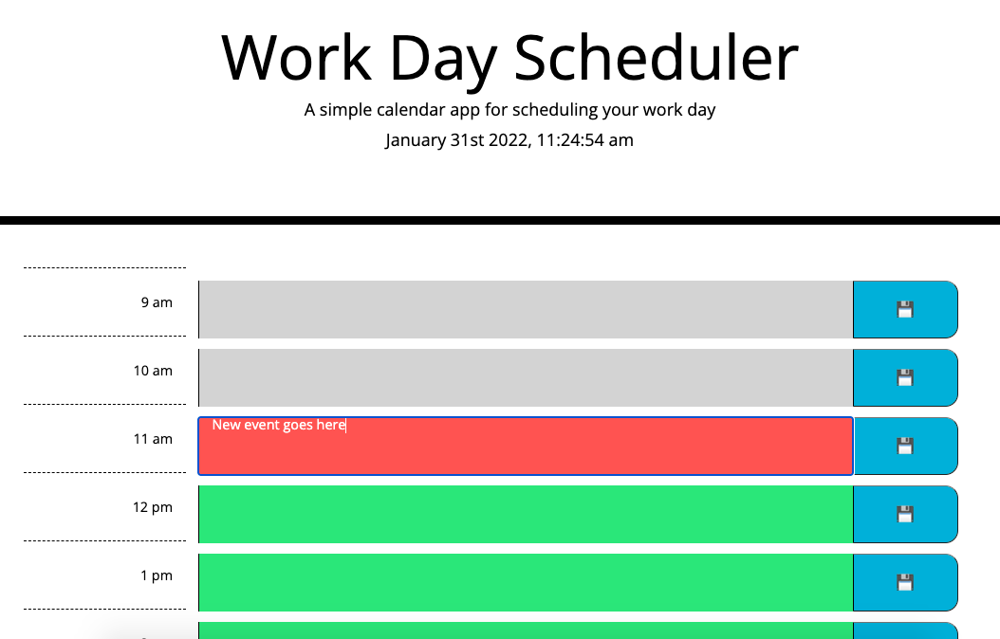

# Day Planner

## Description
The day planner has timeslots for every hour throughout the work day and can be used to plan events. The timeslots are color coded depending on the time of the day - grey for past timeslots, red for current hour, and green for future timeslots.

## Usage
The user can enter events in to the timeslots on the day planner and save them to local storage. If an event is saved, it will be available when the user refreshes the page. 

The application can be found here: https://emmareimer.github.io/day_planner/

The following image shows the web application's appearance and functionality:

